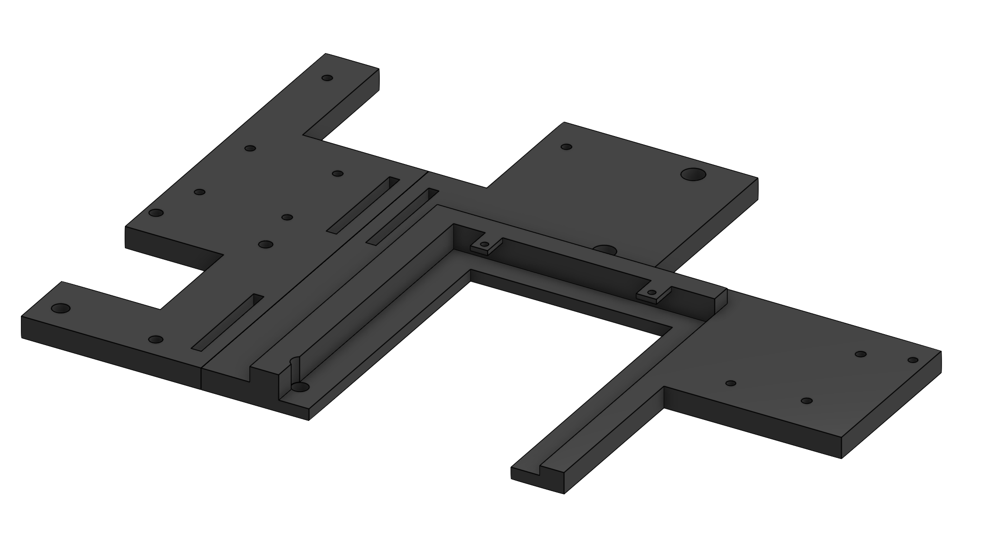
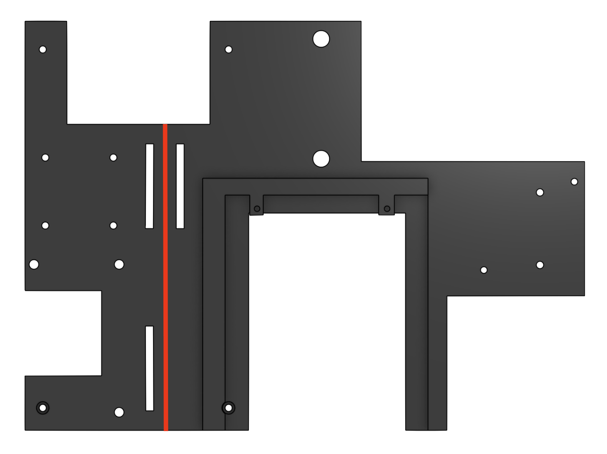
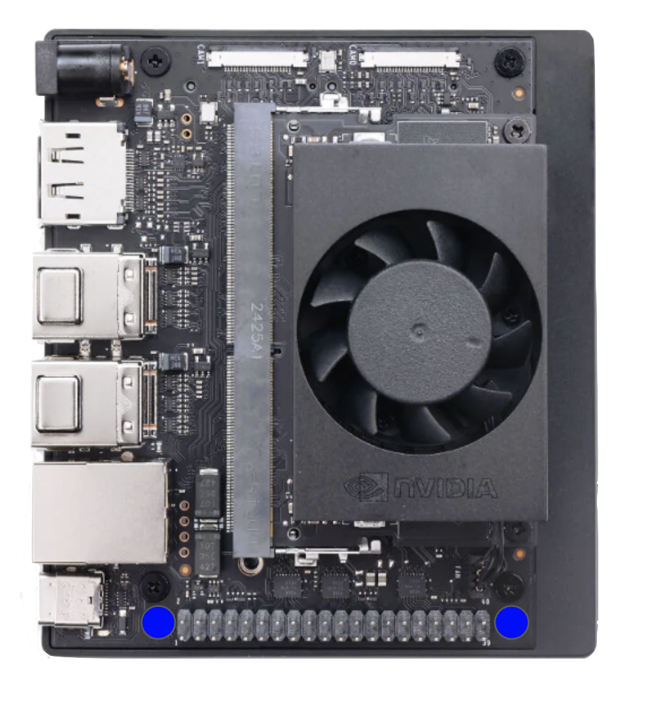
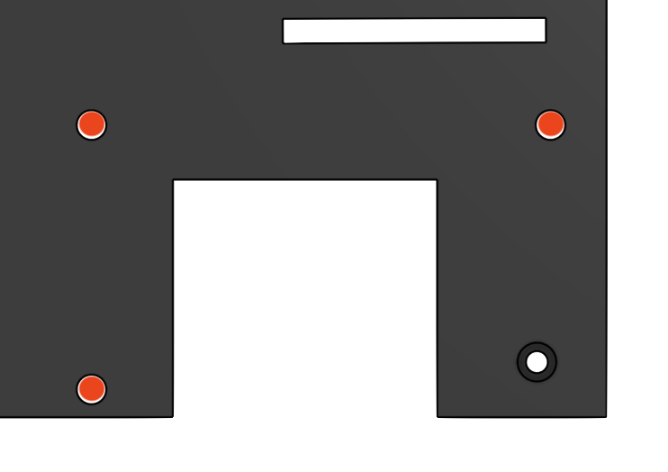
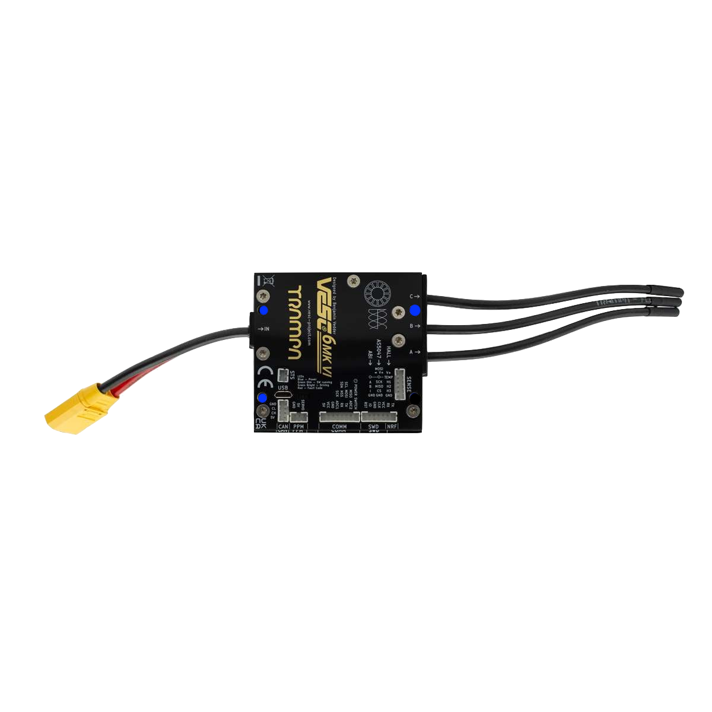
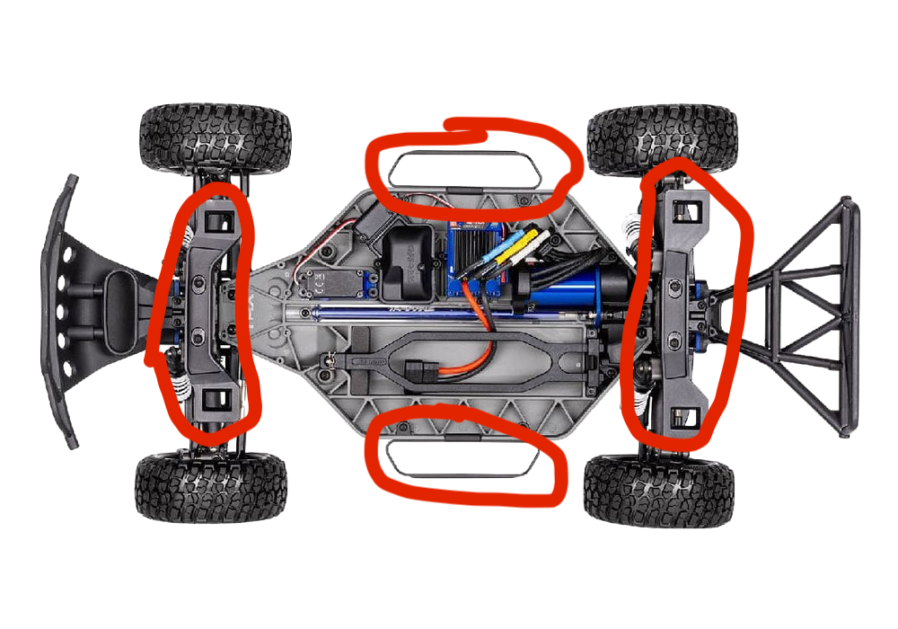
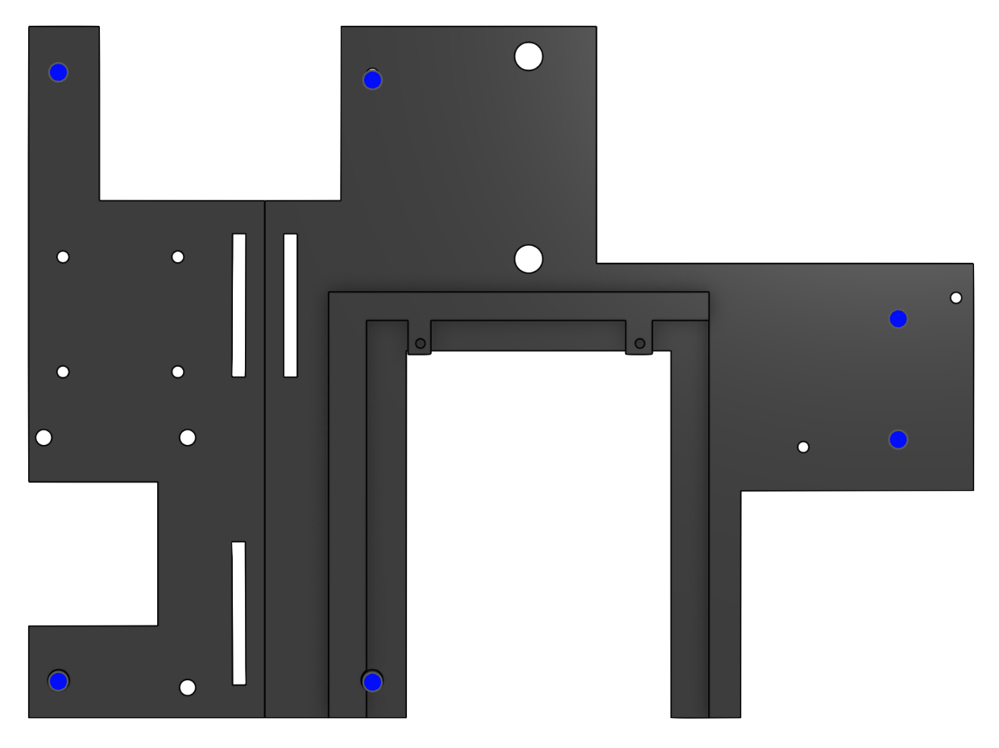

# Sagol-Jengban Assembly

## Materials
### Electronics
* DC Buck Converter
* Jetson Orin Nano(Alternative to Jetson Orin NX/TX2)
### Assembly Tools
* M2.5 and M3 Screws
* M2.5, M3 Hex Key
* Super Glue

## Recommended Print Settings
* **Wall Loops:** 3
* **Infill Density:** 25%
* **Filament Type:** PLA or PLA+

## Instructions
1. Print both parts(or any alternatives) in the recommended print settings
2. Setting up the plate
* Using super glue, glue the two plates together along the red line shown in the image

3. Mounting the Jetson
* On either side of the Jetson GPIO pin section, locate the two mounting pins

* Locate the two SBC mounting screw holes on Side A of the plate, and screw the Jetson in with the two M2.5 Screws.

4. Mounting the VESC
* Locate the 3 M5 size screw holes in the pattern highlighted in red on Side B of the plate 

* Mount the VESC through the highlighted blue holes onto the screw holes on the plate

*Note: The other hole in the corner is for mounting the plate to the car, DO NOT USE TO MOUNT THE VESC* 

5. Mounting the LiDar 

6. Mount the plate to the car
* Prepare the lower chassis by removing the side handles and the shell mount as highlighted in the image below

* Locate all open Car-Mount specific screw holes left on the plate

* Using the M3 screw holes left behind after the removal of the side handles, Attach an appropriate amount of M3 brass pillars to match the height of the front shell-mount screw holes
* Align the plates screw holes with the brass pillars screw holes and properly mount the plate in place

## Finished Product
